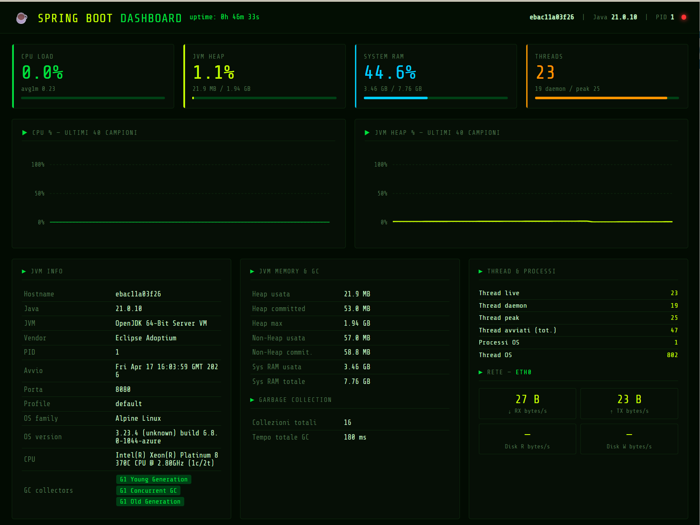

# 🔬 Esercizio B: Gestione di container Docker

> **Prerequisito**: completare [Esercizio A](README.md#-esercizio-a-dev-container--configurazione-dellambiente-di-sviluppo) (configurazione Dev Container).

## Obiettivo

Fare il fork e clonare il repository `cloud-computing-lab`, avviare container Docker con applicazioni
Node.js, Java e PHP/MariaDB e testarle dall'interno del Codespace.

## Competenze

✅ Fare il fork e clonare un repository GitHub  
✅ Avviare container con `docker run` e `docker compose`  
✅ Testare API REST con il browser e `curl`  
✅ Aprire il progetto in GitHub Codespaces  

## Struttura del repository

```
cloud-computing-lab/
├── .devcontainer/
│   └── devcontainer.json          ← Ambiente Codespace (Node 24 + Docker-in-Docker)
├── nodejs-app/                    ← App Node.js standalone (avvio diretto con npm)
└── docker-container/              ← Container Docker pronti all'uso
    ├── nodejs/                    ← Node.js + Express (Dockerfile + docker run)
    ├── java-spring/               ← Spring Boot (Dockerfile multi-stage, porta 8080)
    └── lamp/                      ← PHP 8.2 + Apache + MariaDB (docker-compose, porta 8888)
```

## Container disponibili

| Container | Stack | Porta | Avvio |
|-----------|-------|-------|-------|
| `nodejs/` | Node.js 20 + Express | 3000 | `docker run` |
| `java-spring/` | Java 21 + Spring Boot | 8080 | `docker run` |
| `lamp/` | PHP 8.2 + Apache + MariaDB 10.11 | 8888 | `docker compose` |

---

## Parte 1: Fork e Clone del Repository

### Step 1.1: Fork del repository

1. Apri [github.com/filippo-bilardo/cloud-computing-lab](https://github.com/filippo-bilardo/cloud-computing-lab)
2. Click su **Fork** (in alto a destra)
3. Seleziona il tuo account → **Create fork**

### Step 1.2: Clone in locale (opzionale)

```bash
git clone https://github.com/TUO_USERNAME/cloud-computing-lab.git
cd cloud-computing-lab
```

> ⚠️ Puoi anche lavorare direttamente nel browser usando GitHub Codespaces (→ Parte 5).

---

## Parte 2: Container Node.js

### Step 2.1: Esplora il codice

```bash
cat docker-container/nodejs/server.js
```

Il container espone un'API Express su porta 3000 con endpoint `/` e `/health`.

### Step 2.2: Esplora il Dockerfile

```bash
cat docker-container/nodejs/Dockerfile
```

Il file contiene 7 istruzioni, ognuna crea un **layer** dell'immagine:

```dockerfile
FROM node:20-alpine
```
**Immagine base**: Node.js 20 su Alpine Linux (~5 MB).  
Alpine è una distribuzione Linux minimale, ideale per container perché riduce le dimensioni
dell'immagine finale rispetto a Debian/Ubuntu (~50 MB vs ~900 MB).

```dockerfile
WORKDIR /app
```
**Directory di lavoro** dentro il container. Tutti i comandi successivi (`COPY`, `RUN`, `CMD`)
vengono eseguiti in `/app`. Se la cartella non esiste, Docker la crea automaticamente.

```dockerfile
COPY package*.json ./
RUN npm install
```
**Strategia di cache a due passi**: prima si copiano solo i file `package.json` e
`package-lock.json`, poi si installa. In questo modo, se il codice sorgente cambia ma
le dipendenze rimangono le stesse, Docker riusa il layer di `npm install` dalla cache
(build molto più veloci).

```dockerfile
COPY . .
```
Copia tutto il resto del codice sorgente nel container (escluso ciò che è in `.dockerignore`).
Viene fatto **dopo** `npm install` appositamente per sfruttare la cache.

```dockerfile
EXPOSE 3000
```
**Documenta** la porta su cui il container ascolta. Non apre la porta da sola — è solo
metadata; l'apertura vera avviene con `-p 3000:3000` nel comando `docker run`.

```dockerfile
CMD ["npm", "start"]
```
**Comando di avvio**: eseguito quando il container parte. Usa la forma array (exec form)
per evitare una shell intermedia — il processo Node.js diventa direttamente il PID 1
del container, così riceve correttamente i segnali di stop (`SIGTERM`).

---

**Riepilogo del flusso**:

```
docker build
  └── FROM node:20-alpine          ← scarica l'immagine base
  └── WORKDIR /app                 ← crea /app
  └── COPY package*.json ./        ← copia manifest dipendenze
  └── RUN npm install              ← installa dipendenze (layer cachato)
  └── COPY . .                     ← copia il codice sorgente
  └── EXPOSE 3000                  ← documenta la porta
        ↓
      Immagine pronta

docker run -p 3000:3000
  └── CMD ["npm", "start"]         ← avvia il server Express
```

### Step 2.3: Build dell'immagine

```bash
cd docker-container/nodejs
docker build -t nodejs-api:1.0 .
```

### Step 2.4: Avvio del container

```bash
docker run -d -p 3000:3000 --name nodejs-api nodejs-api:1.0
```

### Step 2.5: Test

```bash
curl http://localhost:3000/
# Output: {"message":"Hello from Node.js!","service":"nodejs-api", ...}

curl http://localhost:3000/health
# Output: {"status":"ok"}
```

VS Code mostra la notifica **"Port 3000 is available"** → click per aprire nel browser.

**Output atteso nel browser:**


### Step 2.6: Cleanup

```bash
docker stop nodejs-api && docker rm nodejs-api
```

---

## Parte 3: Container Java Spring Boot

### Step 3.1: Esplora il codice

```bash
cat docker-container/java-spring/Dockerfile
```

Questo Dockerfile usa il pattern **multi-stage build**: due stadi separati nella stessa
ricetta, in modo da avere un'immagine finale piccola che non contiene Maven né i sorgenti.

---

#### Stage 1 — Build

```dockerfile
FROM maven:3.9-eclipse-temurin-21 AS builder
```
Immagine base con **Maven 3.9** e **JDK 21** già installati. Viene nominata `builder`
per poter essere referenziata dal secondo stage. Questa immagine è grande (~500 MB)
ma viene usata solo durante la compilazione, non nell'immagine finale.

```dockerfile
WORKDIR /app
COPY pom.xml .
RUN mvn dependency:go-offline
```
**Strategia di cache**: si copia prima solo il `pom.xml` e si scaricano tutte le
dipendenze Maven. Se il codice sorgente cambia ma il `pom.xml` rimane invariato,
Docker riusa questo layer dalla cache — il download delle dipendenze non viene ripetuto.

```dockerfile
COPY src ./src
RUN mvn package -DskipTests
```
Copia il codice sorgente e compila il JAR con `mvn package`. Il flag `-DskipTests`
salta i test per velocizzare il build (i test si eseguono separatamente in CI).
L'artefatto finale si trova in `target/*.jar`.

---

#### Stage 2 — Runtime

```dockerfile
FROM eclipse-temurin:21-jre-alpine
```
Immagine base con solo il **JRE** (Java Runtime Environment) su Alpine Linux.
Non include il JDK, Maven, i sorgenti né le dipendenze di build.
Dimensione: ~70 MB vs ~500 MB del builder.

```dockerfile
WORKDIR /app
COPY --from=builder /app/target/*.jar app.jar
```
`--from=builder` copia il JAR compilato dallo stage precedente.
Tutto il resto (sorgenti, dipendenze Maven, cache) viene scartato automaticamente.

```dockerfile
EXPOSE 8080
CMD ["java", "-jar", "app.jar"]
```
Documenta la porta 8080 e avvia l'applicazione Spring Boot.
Forma array (exec form): `java` diventa PID 1 e riceve correttamente i segnali di stop.

---

**Confronto dimensioni immagini**:

| Stage | Base image | Contenuto | Dimensione |
|-------|-----------|-----------|-----------|
| builder | `maven:3.9-eclipse-temurin-21` | JDK + Maven + sorgenti + dipendenze | ~500 MB |
| finale | `eclipse-temurin:21-jre-alpine` | JRE + solo il JAR | ~70 MB |

**Flusso completo**:

```
docker build
  ├── STAGE 1 (builder)
  │     ├── FROM maven:3.9-eclipse-temurin-21
  │     ├── COPY pom.xml → RUN mvn dependency:go-offline   ← layer cachato
  │     ├── COPY src/
  │     └── RUN mvn package → produce target/app.jar
  │
  └── STAGE 2 (finale)
        ├── FROM eclipse-temurin:21-jre-alpine              ← ~70 MB
        ├── COPY --from=builder target/*.jar app.jar        ← solo il JAR
        └── CMD ["java", "-jar", "app.jar"]
              ↓
          Immagine finale: ~70 MB (niente Maven, niente sorgenti)
```

### Step 3.2: Build dell'immagine

```bash
cd docker-container/java-spring
docker build -t spring-dashboard:1.0 .
# Richiede ~2-3 minuti al primo build (scarica dipendenze Maven)
```

### Step 3.3: Avvio del container

```bash
docker run -d -p 8080:8080 --name spring-dashboard spring-dashboard:1.0
```

### Step 3.4: Verifica startup

```bash
# Attendi ~15 secondi, poi:
docker logs spring-dashboard | tail -5
# Cerca: "Started Application in X.XXX seconds"
```

### Step 3.5: Test

```bash
curl http://localhost:8080/
# Output: {"message":"Hello from Java!","service":"spring-dashboard", ...}

curl http://localhost:8080/health
# Output: {"status":"ok"}
```

**Output atteso nel browser:**


### Step 3.6: Cleanup

```bash
docker stop spring-dashboard && docker rm spring-dashboard
```

---

## Parte 4: Stack LAMP (PHP + MariaDB)

Lo stack LAMP usa **Docker Compose** per orchestrare due container: webserver PHP e database MariaDB.
L'applicazione è una **Kanban Board** moderna con persistenza su MariaDB.

### Step 4.1: Esplora il Dockerfile

```bash
cat docker-container/lamp/Dockerfile
```

Il Dockerfile del webserver LAMP è intenzionalmente minimalista:

```dockerfile
FROM php:8.2.5-apache-bullseye
RUN docker-php-ext-install pdo_mysql mysqli
```

```dockerfile
FROM php:8.2.5-apache-bullseye
```
Immagine ufficiale PHP con **Apache già integrato** (`apache-bullseye` = Debian Bullseye).
Contiene PHP 8.2.5 + mod_php + Apache2 preconfigurati per servire file da `/var/www/html/`.
A differenza del container Node.js, qui non si copia il codice nell'immagine: viene
montato come **volume** in `docker-compose.yml` (vedi Step 4.2).

```dockerfile
RUN docker-php-ext-install pdo_mysql mysqli
```
Installa due estensioni PHP necessarie per connettersi a MariaDB:
- **`pdo_mysql`** — driver PDO (astrazione database, usato in `db.php` del progetto)
- **`mysqli`** — driver procedurale/orientato agli oggetti (alternativa a PDO)

> 💡 `docker-php-ext-install` è uno script incluso nell'immagine ufficiale PHP che
> semplifica la compilazione e l'abilitazione delle estensioni.

---

### Step 4.2: Esplora il `docker-compose.yml`

```bash
cat docker-container/lamp/docker-compose.yml
```

Il file orchestra **due servizi** che collaborano sulla stessa rete:

#### Servizio `mariadb`

```yaml
mariadb:
  image: mariadb:10.11
  container_name: lamp_mariadb
  environment:
    MYSQL_ROOT_PASSWORD: ${MYSQL_ROOT_PASSWORD}
    MYSQL_USER: ${MYSQL_USER}
    MYSQL_PASSWORD: ${MYSQL_PASSWORD}
    MYSQL_DATABASE: ${MYSQL_DATABASE}
  volumes:
      - ./volumes/mysql:/var/lib/mysql
  healthcheck:
    test: ["CMD", "healthcheck.sh", "--connect", "--innodb_initialized"]
    interval: 30s
    retries: 3
    start_period: 40s
```

| Chiave | Spiegazione |
|--------|-------------|
| `image` | Usa l'immagine ufficiale MariaDB 10.11, senza Dockerfile custom |
| `environment` | Legge le credenziali dal file `.env` — nessuna password nel codice |
| `volumes: ./volumes/mysql` | Volume Docker persistente: i dati sopravvivono a `docker compose down` |
| `healthcheck` | Verifica che MariaDB sia pronto prima di avviare il webserver |
| `start_period: 40s` | Attende 40s prima di iniziare i check (MariaDB è lento al primo avvio) |

#### Servizio `webserver`

```yaml
webserver:
  image: php:8.2.5-apache-bullseye
  container_name: lamp_webserver
  depends_on:
    mariadb:
      condition: service_healthy
  environment:
    DB_USERNAME: ${DB_USERNAME}
    DB_PASSWORD: ${DB_PASSWORD}
    DB_HOST: ${DB_HOST}
    WEBSERVER_ADMIN_USERNAME: ${WEBSERVER_ADMIN_USERNAME}
    WEBSERVER_ADMIN_PASSWORD: ${WEBSERVER_ADMIN_PASSWORD}
  volumes:
    - ./volumes/www/:/var/www/html/
  ports:
    - "8888"
```

| Chiave | Spiegazione |
|--------|-------------|
| `depends_on: condition: service_healthy` | Aspetta che `mariadb` passi l'healthcheck prima di partire |
| `environment` | Legge credenziali DB e admin dal file `.env` |
| `volumes: ./volumes/www/` | Monta la cartella locale come document root Apache — modifiche al codice PHP sono **immediate** senza rebuild |
| `ports: 8888` | Mappa la porta 8888 dell'host verso la porta 80 del container |

> 🔒 Le password non sono mai scritte nel `docker-compose.yml`. Docker Compose legge
> automaticamente il file `.env` nella stessa cartella e sostituisce le variabili `${...}`.

#### Rete

```yaml
networks:
  lamp_network:
    driver: bridge
    name: nginx_proxy_network
```

- La rete `lamp_network` isola i container e permette a `webserver` di raggiungere
  `mariadb` usando il nome del servizio come hostname (es. `DB_HOST: mariadb`)
- Il nome `nginx_proxy_network` è scelto per essere compatibile con il futuro stack Nginx

**Flusso di avvio**:

```
docker compose up -d
  ├── Avvia lamp_mariadb
  │     └── healthcheck ogni 30s → attende che innodb sia inizializzato
  │
  └── (solo quando mariadb è healthy)
        Avvia lamp_webserver
              └── Apache serve /var/www/html/ (= ./volumes/www/ in locale)
                    └── al primo accesso HTTP → db.php crea DB + tabella + 12 task seed
```

---

### Step 4.3: Configurazione

```bash
cd docker-container/lamp
cp .env.example .env
# Modifica .env se vuoi cambiare le credenziali (opzionale)
```

### Step 4.4: Avvio dello stack

```bash
docker compose up -d
```

### Step 4.3: Verifica stato

```bash
docker compose ps
# Entrambi i container devono essere "Up (healthy)"
```

### Step 4.4: Test

```bash
# Health check API
curl http://localhost:8888/api.php?action=ping
# Output: {"status":"ok","db":"taskmanager","php":"8.2.x"}

# Lista task
curl http://localhost:8888/api.php?action=list
```

Apri `http://localhost:8888` nel browser per vedere la **Kanban Board** con i task dell'esercitazione.

### Step 4.5: Operazioni CRUD

Testa la Kanban Board nell'interfaccia grafica:

| Azione | Come farlo |
|--------|-----------|
| Aggiungi task | Click su **＋ Nuovo Task** (in alto a destra) |
| Modifica task | Hover sulla card → click ✏️ |
| Sposta task | Trascina la card in un'altra colonna |
| Elimina task | Hover sulla card → click 🗑️ → conferma |

### Step 4.6: Cleanup

```bash
docker compose down
# I dati rimangono nel volume mysql_data
# Per eliminare anche i dati: docker compose down -v
```

---

## Parte 5: Aprire in GitHub Codespaces

### Step 5.1: Crea il Codespace

1. Vai sul tuo fork GitHub
2. Click su **Code** (verde) → tab **Codespaces**
3. Click **Create codespace on main**
4. Attendi 1–2 minuti → VS Code si apre nel browser

### Step 5.2: Verifica installazioni

```bash
node --version    # v24.x
docker --version  # Docker 27.x (Docker-in-Docker)
```

### Step 5.3: Crea la rete Docker condivisa

```bash
docker network create nginx_proxy_network
# Necessaria per lo stack LAMP
```

### Step 5.4: Testa tutti i container nel Codespace

```bash
# Node.js
cd docker-container/nodejs
docker build -t nodejs-api:1.0 . && docker run -d -p 3000:3000 --name nodejs-api nodejs-api:1.0
curl http://localhost:3000/

# Java Spring
cd ../java-spring
docker build -t spring-dashboard:1.0 . && docker run -d -p 8080:8080 --name spring-dashboard spring-dashboard:1.0
# attendi ~15s
curl http://localhost:8080/

# LAMP
cd ../lamp
cp .env.example .env
docker compose up -d
curl http://localhost:8888/api.php?action=ping
```

VS Code mostra le notifiche per ogni porta aperta → click per aprire nel browser integrato.

---

## Parte 6: App Node.js standalone (senza Docker)

Il repository include anche `nodejs-app/` — una versione dell'app Node.js che gira
direttamente nell'ambiente Codespace, **senza Docker**.

```bash
cd nodejs-app
npm install
npm start
# Output: ✅ Node.js app running on port 3000
```

Utile per confrontare:
- **Con Docker** (`docker-container/nodejs/`): app isolata, riproducibile ovunque
- **Senza Docker** (`nodejs-app/`): avvio diretto, dipende dall'ambiente host

---

## ✅ Verifica completamento

- [ ] Repository forkato e clonato
- [ ] Container Node.js avviato e testato (`curl http://localhost:3000/`)
- [ ] Container Java Spring avviato e testato (`curl http://localhost:8080/`)
- [ ] Stack LAMP avviato (`docker compose up -d`) e testato (ping API)
- [ ] Kanban Board aperta nel browser su porta 8888
- [ ] Operazioni CRUD eseguite sulla Kanban Board
- [ ] Codespace aperto e stack testato
- [ ] Commit e push effettuati

---

## 📸 Screenshot da consegnare

1. Terminale: output di `docker ps` con tutti i container in esecuzione
2. Browser: Kanban Board (`http://localhost:8888`) con i task nelle tre colonne
3. Browser o terminale: risposta JSON di `/api.php?action=ping`
4. Browser o terminale: risposta JSON di Node.js API (`http://localhost:3000/`)
5. Browser o terminale: risposta JSON di Spring Boot API (`http://localhost:8080/`)
6. Codespace aperto (screenshot di VS Code nel browser con il terminale visibile)

---

## ⚠️ Troubleshooting

### Problema: "Cannot connect to the Docker daemon"

**Causa**: Docker daemon non ancora pronto nel Codespace (prime fasi di setup).  
**Soluzione**: Attendi 30 secondi e riprova. Verifica che `devcontainer.json` abbia la feature `docker-in-docker:2` con `"moby": false`.

### Problema: `lamp_webserver` in stato `Exit` o `Restarting`

```bash
docker compose logs webserver
```

Se l'errore riguarda MariaDB non ancora pronto, attendi ~40 secondi e:
```bash
docker compose up -d
```

### Problema: Rete `nginx_proxy_network` non trovata

```bash
docker network create nginx_proxy_network
docker compose up -d
```

### Problema: Port forwarding non funziona

1. Tab **Ports** in VS Code → **Add Port** → inserisci `3000`, `8080` o `8888`
2. Click sull'icona 🌐 per aprire nel browser
3. Verifica che `forwardPorts` in `devcontainer.json` includa le porte necessarie

### Problema: Spring Boot impiega troppo a partire

Il primo `docker build` di Java scarica ~200 MB di dipendenze Maven.  
Le build successive usano la cache Docker e impiegano < 30 secondi.

```bash
docker logs spring-dashboard -f
# Attendi la riga: "Started Application in X.XXX seconds"
```
